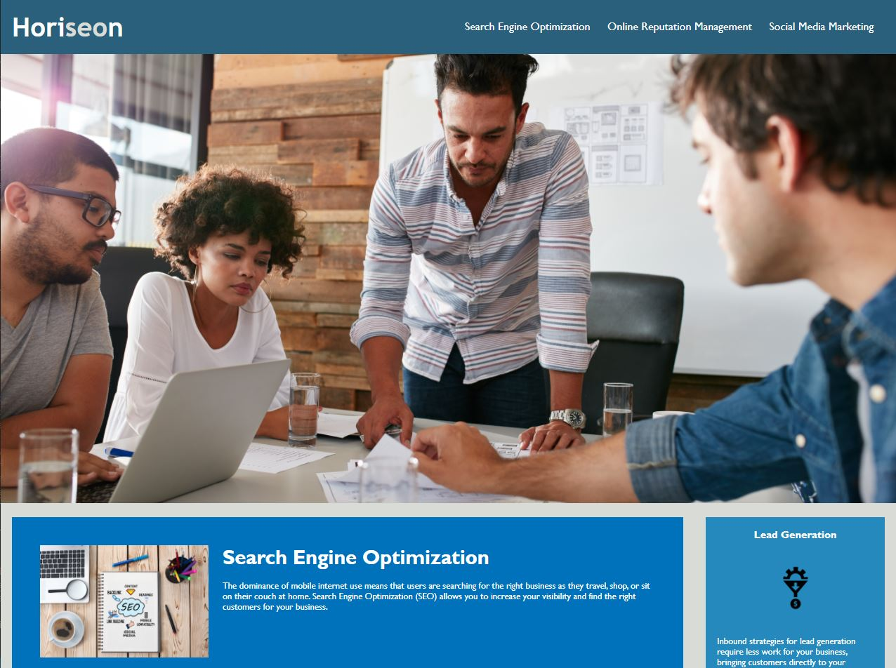

# code-refactor

## Purpose

The marketing agency, Horiseon, wanted their website to follow accessibility standards and be optimized for search engines.

## Built With
* HTML
* CSS

## Process
The first thing I did to improve SEO was to give a title to their website.This ensures that the user can view what website they are on just by looking at the tab on their window. 

I added a missing id to search engine optimization to fix non-functionality of clicking the top menu. 

I gave semantic structure to the HTML element which will improve it's SEO. I ammended the CSS style sheet to reflect the changes I made to the html. 

Accessible alt attributes were added to the important images on the page to improve accessibility.

## URL Link
https://andrea-rowland.github.io/code-refactor/

